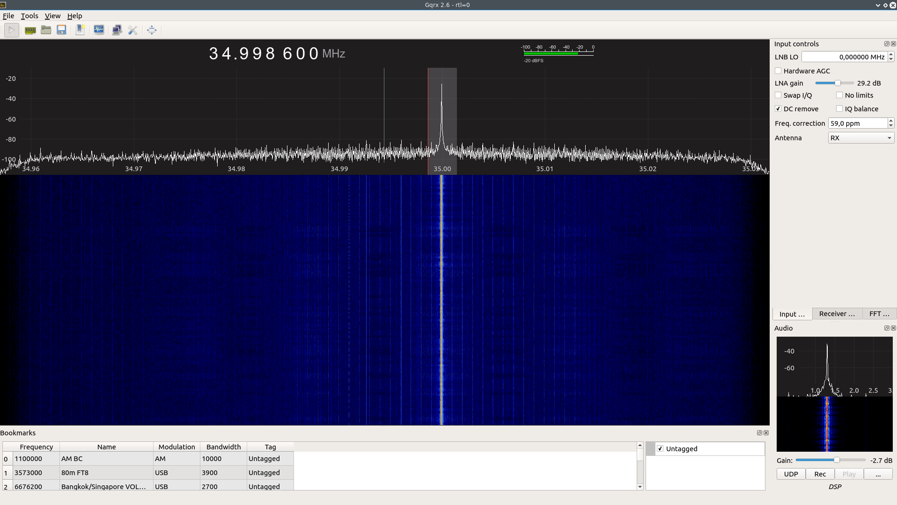
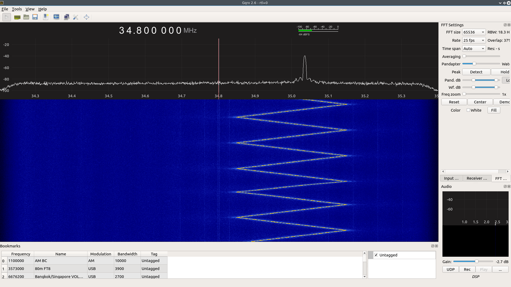

# AD9851 - DDS Module Controller Library for Arduino (written in C)
This library utilizes any Arduino pins to be used as AD9851 control pins. This will gives you flexibility to use or to reserve any Arduino pins for other functions. The drawback, the frequency update rate will be somewhat limited to the `digitalWrite()` function's clock cycle. 
This library ONLY supports the AD9851 DDS modules which have **30MHz clock**.


## Instalation
* Download as .zip
* Open Arduino IDE.
* From **Sketch**, **Include Library >> Add .ZIP Library...**
* Choose the downloaded .zip. (when downloaded, more likely be named **AD9851-master.zip**)
* Restart the Arduino IDE

## Usage
### GPIO Definitions and Initialization
```C
// start off by including the library
#include <AD9851.h>

// define the GPIO pins to be used
// you can use any pins you like
#define RST 8
#define DATA 9
#define FQ  10
#define CLK 11

// Declare a DDS struct variable, globally or locally, depends on the scope
DDS dds;

// somewhere in your setup() function
// call the dds_init() function to construct dds_pin structure 
// and initialize the GPIO for you
dds = dds_init(RST, DATA, FQ, CLK);

// now you are ready to go!!
```
### Available Functions
```C
// This function will construct dds_pin structure and initialize the GPIO
// The input arguments should be the dds pins GPIO definition
// with the exact sequence: RST_pin, DATA_pin, FQ_pin, and CLK_pin respectively
// Call this function first at your setup() and store the return value into your DDS struct variable
// example: see Example senction below
struct DDS dds_init(int rst_pin, int data_pin, int fq_pin, int clk_pin);

// This function will reset the AD9851 DDS module
// The input argument should be the DDS struct variable
// You should call this function after the initialization
// and before doing any frequency writing process
void dds_reset(DDS dds);

// This function will write the desired frequency into AD9851 and generate SINE WAVE
// The 6 x Clock multiplier is always enabled (assume that you are using 30 MHz clock)
// Frequency range: DC - 90 MHz (DC - 60 MHz in practice)
// Input arguments are DDS struct variable and the desired frequency in Hertz (unsigned long)
void writeFreq(DDS dds, unsigned long freq);

// This function will generate Frequency Sweep signal
// Input arguments: - DDS struct variable
//                  - center frequency in Hertz (unsigned long)
//                  - sweep deviation in Hertz (unsigned long)
//                  - sweep step or frequency resolution in Hertz (long)
//                  - sweep delay in microseconds (unsigned int)
//
// To generate sweep-up tone, sweep step must be a positive value, hence,
// to generate sweep-down tone, sweep step must be a negative value.
//
// Example: center freq = 30 MHz, sweep deviation = 100 kHz, sweep step = 100 Hz
// will results in a sweep-up tone from 29950000 Hz to 30050000 Hz with sweep step of 100 Hz
// After reaches 30050000 Hz (last step), then it will stay there 
// unless the sweepTone() function is being called again.
//
// REQUIREMENTS: - center frequency must be between DC - 90 MHz
//               - sweep deviation must be less than the twice of the center frequency value
//               - sweep step must be less than the sweep deviation divided by 65535
//               - delay in microseconds must be less than 65535 
//
// FAIL TO MEET THE REQUIREMENTS ABOVE MAY RESULTS IN ABNORMAL OR UNPREDICTABLE BEHAVIOR
void sweepTone(DDS dds, unsigned long c_freq, unsigned long s_dev, long s_step, unsigned int delay_us);
```

## Example
After installation, open your Arduino IDE. From **File**, click **Examples >> AD9851 >> ...**
There are three examples included:
* Generate_Tone
* Generate_Sweep, and
* Generate_Random_Hopping

All the three examples are using Arduino to AD9851 GPIO map as follows:
* AD9851-RST = Arduino-PIN-8
* AD9851-DATA = Arduino-PIN-9
* AD9851-FQ = Arduino-PIN-10
* AD9851-CLK = Arduino-PIN-11

### Generate_Tone
Frequency: 35 MHz


### Generate_Sweep
* Center Freq: 35 MHz
* Deviation: 300 kHz
* Frequency Step: + and - 100 Hz
* Delay: 1 uS


### Generate_Random_Hopping
* Minimum Freq: 34.8 MHz
* Maximum Freq: 35.2 MHz


## Contributing
1. Fork it [https://github.com/handiko/AD9851/fork](https://github.com/handiko/AD9851/fork)
2. Create new branch (`git checkout -b myfeature`)
3. Do some editing / create new feature
4. Commit your works (`git commit -m "Adding some feature blah blah blah.."`)
5. Push to the branch (`git push -u origin myfeature`)
6. Create a new Pull Request
